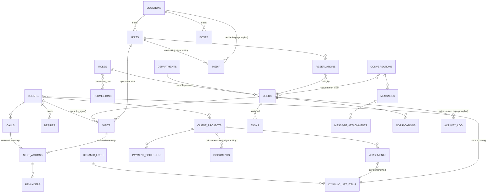

# Database · 00 — Schema Overview & ERD

MySQL stores everything, and its design follows the same traceability rules as the rest of the system.
Schema changes are made **only through migrations**, so the structure is versioned alongside the code.

> **Design note.** The build guide references a separate *Scope of Work* ERD that is **not present in
> this project**. The schema below is a **proposed, complete design** derived from the guide plus
> real‑estate CRM best practice. Treat it as the reference to confirm before Phase 1 migrations are
> written; adjust field names/types here first, then build migrations to match.

---

## 1. Conventions (guide §6.1) — apply to every table

- **Migrations only** — never change the schema by hand; every change is a reviewable migration file.
- **Plural snake_case tables, singular FKs** — `units`, `client_projects`; `location_id`, `client_id`.
- **Timestamps everywhere** — `created_at` + `updated_at` on every table (except the append‑only
  `activity_log`, which has only `created_at`).
- **Status over deletion** — every table carries `status` (`active` / `cancelled`) and
  `cancellation_reason`; rows are **never removed**.
- **Indexes** on foreign keys and on the columns you filter by (`status`, dates), so lists stay fast.

### Cross‑cutting columns on every domain table (from `BaseModel`)

| Column | Type | Purpose |
|--------|------|---------|
| `id` | bigint unsigned PK | — |
| `status` | enum/string `active`\|`cancelled`, default `active` | no‑delete (Cancellable) |
| `cancellation_reason` | string, nullable | why a row was cancelled |
| `supersedes_id` | bigint unsigned, nullable, self‑FK | links a correction to the row it replaces (HasVersions) |
| `created_at` / `updated_at` | timestamps | — |

Standard indexes: index every FK; add composite `(status, <primary date>)` on list‑heavy tables.

---

## 2. The no‑delete / versioning pattern in the schema (guide §6.2)

The immutability rule shows up directly in table design: a correction **cancels the original and
inserts a corrected row that links back to it**, so both remain in history.

```php
// Example migration: versements (instalments)
Schema::create('versements', function (Blueprint $t) {
    $t->id();
    $t->foreignId('client_project_id')->constrained();
    $t->decimal('amount', 12, 2);
    $t->date('paid_on');
    $t->string('status')->default('active');            // active | cancelled
    $t->string('cancellation_reason')->nullable();
    $t->foreignId('supersedes_id')->nullable()          // links a fix
       ->constrained('versements');
    $t->timestamps();
    $t->index(['client_project_id', 'status']);
});
```

**Three patterns, one base model** (see [`../phase-0-foundations/04-core-base-model.md`](../phase-0-foundations/04-core-base-model.md)):

| Pattern | When | Effect |
|---------|------|--------|
| `Cancellable` | any "delete" | `status → cancelled` + reason; row stays |
| `LogsActivity` | ordinary edits | before/after written to `activity_log`; nothing hidden |
| `HasVersions` (`supersedes_id`) | immutable records (versements, units, documents) | cancel original + insert linked replacement in one transaction |

---

## 3. Two naming decisions resolved

1. **`locations` = real‑estate projects/buildings/sites** (the inventory entity that holds units and
   boxes). The *geographic dropdown* from the guide's "payment methods, floors, **locations**, sources"
   example is modelled as the **`areas`** dynamic list to avoid the name clash. Wherever the guide says
   a "locations" dropdown, read **areas**.
2. **`client_projects`** is the deal/opportunity a client is pursuing (a client may have several).
   Payments (`versements`), the payment `schedule`, and `desires` hang off a `client_project`, not the
   raw `client`. (For a simpler v1 you *may* collapse this to `clients` directly — but the guide's own
   `versements.client_project_id` example uses `client_projects`, so we keep it.)

---

## 4. Entity‑relationship diagram (proposed)



---

## 5. Table inventory by module (detailed docs linked)

| Module | Tables | Doc |
|--------|--------|-----|
| Settings | `roles`, `permissions`, `permission_role`, `departments`, `users`, `dynamic_lists`, `dynamic_list_items` | [`01-settings.md`](01-settings.md) |
| Inventory | `locations`, `units`, `boxes`, `reservations`, `media` | [`02-inventory.md`](02-inventory.md) |
| Clients & Pipeline | `clients`, `client_projects`, `desires`, `calls`, `visits`, `tasks`, `next_actions`, `reminders` | [`03-clients-pipeline.md`](03-clients-pipeline.md) |
| Payments | `versements`, `payment_schedules`, `documents` | [`04-payments.md`](04-payments.md) |
| Collaboration | `notifications`, `conversations`, `conversation_user`, `messages`, `message_attachments` | [`05-collaboration.md`](05-collaboration.md) |
| Analytics & Audit | `activity_log` (+ read‑side views) | [`06-analytics-audit.md`](06-analytics-audit.md) |

---

## 6. Migration order (respect FK dependencies)

Build migrations roughly in this order so foreign keys resolve:

1. `roles`, `permissions`, `permission_role`, `departments`
2. `users` (FK → roles, departments)
3. `activity_log` (FK → users)
4. `dynamic_lists`, `dynamic_list_items`
5. `locations` → `units`, `boxes` → `reservations`
6. `media` (polymorphic)
7. `clients` → `client_projects` → `desires`
8. `calls`, `visits`, `tasks`, `next_actions`, `reminders`
9. `versements`, `payment_schedules`, `documents`
10. `conversations`, `conversation_user`, `messages`, `message_attachments`, `notifications`

> Each table is created **in the phase that first needs it** (vertical slices), not all up front. This
> order is the dependency reference, not a "big‑bang migration" instruction.

**Next:** [`01-settings.md`](01-settings.md)
